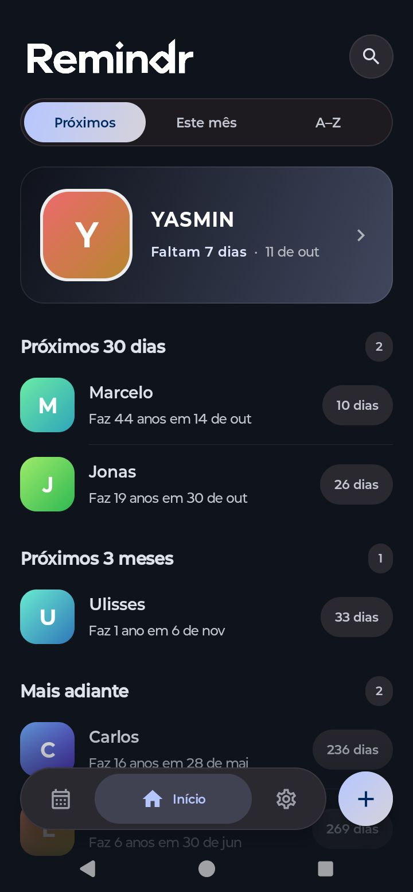
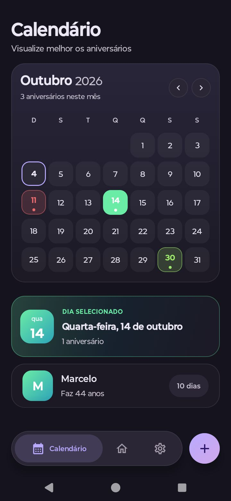
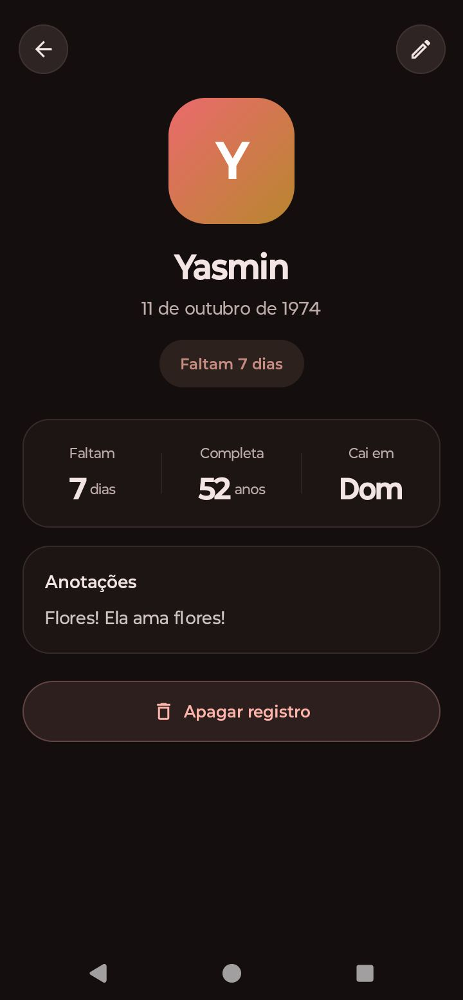
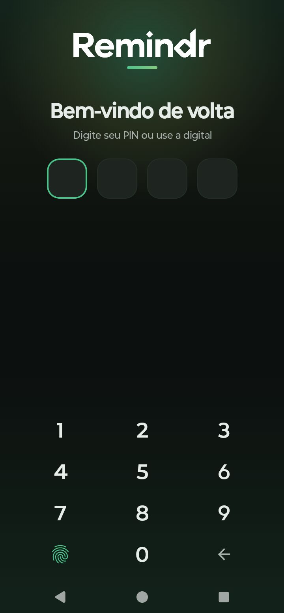
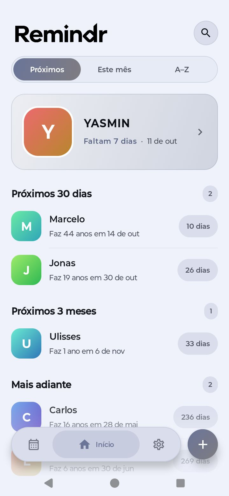
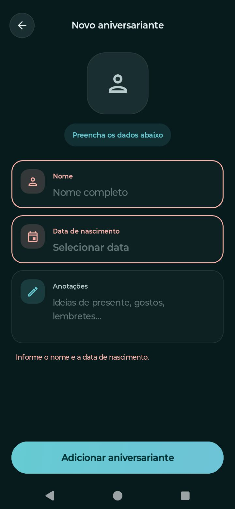
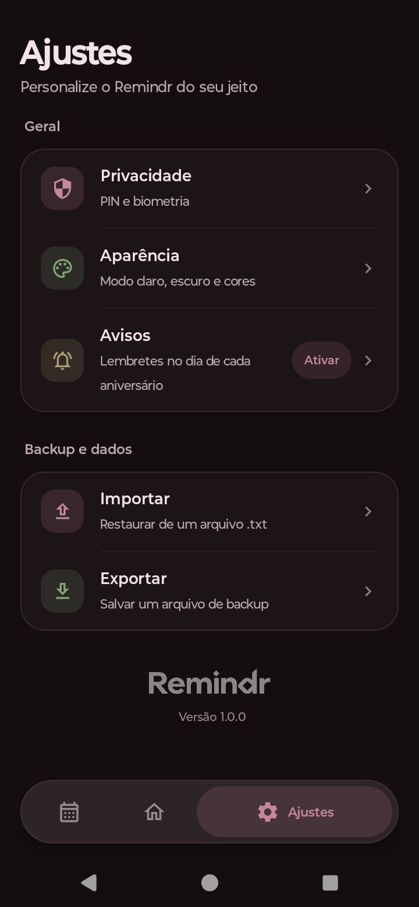
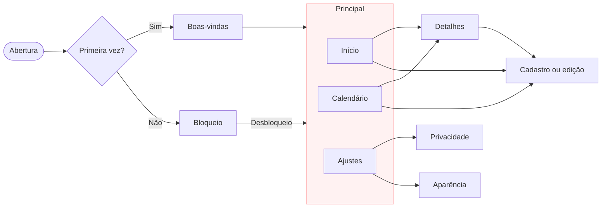

<div align="center">


<h3>Nunca mais esqueça um aniversário</h3>

<br/>


<br/>

Um app Android que lembra você dos aniversários que importam, no dia em que acontecem.<br/>
Sem conta, sem login e sem precisar de internet.

<br/>

<br/>

| Aviso no dia certo | Calendário do ano todo | Dados só no aparelho | Com a sua cara |
|:---:|:---:|:---:|:---:|
| Uma notificação em cada aniversário, sem você precisar lembrar de nada. | Todas as datas num só lugar, mês a mês. | PIN e digital para abrir o app, sem conta e sem nuvem. | Modo claro, escuro e paletas de cor para escolher. |

</div>

<br/>

## Demonstração

<div align="center">

<br/>

<table>
  <tr>
    <td align="center"><br/><sub><b>Início</b><br/>O próximo aniversário em destaque</sub></td>
    <td align="center"><br/><sub><b>Calendário</b><br/>O mês inteiro de relance</sub></td>
    <td align="center"><br/><sub><b>Detalhes</b><br/>Contagem, idade e anotações</sub></td>
    <td align="center"><br/><sub><b>Bloqueio</b><br/>PIN ou impressão digital</sub></td>
  </tr>
</table>

<table>
  <tr>
    <td align="center"><br/><sub><b>Modo claro<br/>Modos com paletas de cores</sub></td>
    <td align="center"><br/><sub><b>Cadastro</b><br/>Com validação dos campos</sub></td>
    <td align="center"><br/><sub><b>Ajustes</b><br/>Avisos, privacidade e backup</sub></td>
  </tr>
</table>

<br/><br/>

**Vídeo de Demonstração com App Funcionando**

https://github.com/user-attachments/assets/4d3cf25b-044d-4fbb-82b0-5ca680dd96a9

<br/>

</div>

---

## Sobre o projeto

O Remindr é um aplicativo Android que faz uma coisa só e tenta fazer bem: lembrar você dos aniversários que importam, no dia em que acontecem. Você cadastra a pessoa uma vez, com nome, data de nascimento e, se quiser, algumas anotações. A partir daí, o app manda uma notificação todo ano, no dia certo.

Quis um app que não pedisse mais do que o necessário. Não tem conta, não tem login e não precisa de conexão com a internet. Tudo fica guardado no próprio aparelho e, se você preferir, o app só abre com PIN ou impressão digital. Em compensação, caprichei no que aparece na tela: a interface é toda feita em Jetpack Compose, com animações suaves, um calendário visual e paletas de cor para deixar o app do seu jeito.

> [!NOTE]
> No momento, a interface do app está SOMENTE em português do Brasil.

---

## Para que serve

O problema que o Remindr resolve é pequeno, mas aparece o ano inteiro. Alguns jeitos de usar:

| Uso | Como o Remindr ajuda |
|---|---|
| **Família** | Avós, tios, primos, sobrinhos. Cadastre uma vez e o aviso chega todo ano, sem depender de alguém lembrar no grupo da família. |
| **Amigos** | A notificação chega no próprio dia, a tempo de mandar uma mensagem, ligar ou combinar um encontro. |
| **Trabalho e clientes** | Colegas, equipe e clientes também fazem aniversário. Um parabéns na hora certa ajuda a manter o contato próximo. |
| **Presentes** | Anote gostos e ideias no perfil de cada pessoa e consulte quando a data chegar perto. A contagem de dias ajuda a não deixar a compra para a última hora. |
| **Turmas, times e grupos** | Quem cuida de uma turma, de um time ou de uma comunidade consegue manter todas as datas organizadas por mês ou em ordem alfabética. |
| **Planejamento do mês** | O filtro **Este mês** e o calendário mostram quem faz aniversário nas próximas semanas, o que ajuda a organizar uma festa ou uma vaquinha para o presente. |
| **Privacidade** | Sem conta e sem nuvem. As datas e as anotações ficam no aparelho, e o app pode exigir PIN ou digital para abrir. |
| **Trocar de celular** | O backup em arquivo leva a sua lista para o aparelho novo em poucos toques. |

### Na prática

1. Você cadastra a Marina, com a data de nascimento e uma anotação: "gosta de livros de suspense".
2. Ela entra na lista de próximos aniversários. Quando for a próxima da fila, ganha o card de destaque na tela inicial, com a contagem de dias.
3. Perto da data, você abre o perfil dela e vê quantos anos ela vai completar e a ideia de presente que anotou.
4. No dia, o Remindr manda a notificação. Dá tempo de ligar, mandar mensagem ou aparecer com o presente.

---

## Funcionalidades

### Tela inicial
- Mostra em destaque quem faz aniversário primeiro, com a contagem regressiva: "Faltam 12 dias", "É amanhã" ou "É hoje!".
- Três jeitos de ver a lista: **Próximos**, **Este mês** e **A–Z**.
- No modo **Próximos**, as pessoas aparecem agrupadas por proximidade: hoje, próximos 7 dias, próximos 30 dias, próximos 3 meses e mais adiante.
- Busca por nome, que abre com uma animação na própria barra do topo.

### Calendário
- Grade do mês com marcadores coloridos nos dias que têm aniversário.
- Navegação entre os meses e um atalho para voltar rápido ao dia de hoje.
- Ao tocar em um dia, aparece o resumo dele e a lista de quem faz aniversário. Dali você abre os detalhes da pessoa.

### Cadastro e detalhes
- Cadastro com nome, data de nascimento e anotações livres. O app valida os campos e não aceita datas futuras.
- Enquanto você escolhe a data, o cadastro já mostra quantos dias faltam para o aniversário.
- Cada pessoa ganha um avatar com cor própria, gerado a partir da inicial do nome. A mesma cor aparece no calendário.
- A tela de detalhes mostra quantos dias faltam, que idade a pessoa vai completar e em que dia da semana cai o aniversário.
- Quem nasceu em 29 de fevereiro não fica de fora: em anos que não são bissextos, o app considera 28 de fevereiro.
- Para apagar alguém, o app pede confirmação.

### Lembretes
- O aviso é uma notificação no dia do aniversário, agendada com alarmes do Android.
- Os alarmes são atualizados sempre que você adiciona, edita ou remove alguém.
- O botão **Ativar**, em Ajustes, guia você pelas permissões de notificação (Android 13 ou superior) e de alarmes exatos (Android 12 ou superior).

### Privacidade
- PIN de 4 dígitos, com teclado próprio, e desbloqueio por impressão digital.
- Para redefinir o PIN, o app exige a biometria do aparelho. Ninguém troca a sua senha sem passar por ela.
- Sem nenhuma proteção ativa, o app abre com um toque em **Entrar** e sugere ativar o PIN ou a digital em Ajustes.

### Aparência
- Tema claro, escuro ou o mesmo do sistema.
- Paletas de cor como Padrão, Oceano, Floresta e Aurora, cada uma com versão clara e escura.

### Backup
- Exporta todos os aniversários para um arquivo `.txt`.
- Importa a partir de um backup usando o seletor de arquivos do Android, sem pedir permissão de armazenamento.
- Serve como cópia de segurança e também para levar a lista para outro aparelho.

---

## Fluxo do aplicativo



---

## Tecnologias

| Área | Tecnologia | Uso no app |
|---|---|---|
| **Linguagem** | Kotlin | Todo o aplicativo |
| **Interface** | Jetpack Compose e Material Design 3 | Telas, temas claro e escuro e animações |
| **Lembretes** | AlarmManager e notificações do Android | Aviso no dia do aniversário |
| **Segurança** | AndroidX Biometric (BiometricPrompt) | Desbloqueio por impressão digital |
| **Armazenamento** | Banco local (`RemindrDatabase`) e SharedPreferences | Aniversários e preferências de aparência |
| **Backup** | Storage Access Framework | Exportar e importar o arquivo `.txt` |
| **Datas** | `java.time` | Próximo aniversário, idade e contagem de dias |
| **Build** | Gradle, SDK 34 e JDK 17 | Compilação e execução |

### Como funciona por dentro

- **Dados:** os aniversários ficam em um banco local no aparelho, acessado pela classe `RemindrDatabase`. As escolhas de tema e modo ficam em `SharedPreferences`.
- **Lembretes:** o `ReminderScheduler` agenda um alarme para cada aniversário. Ele roda quando o app abre e toda vez que a lista muda.
- **Datas:** a próxima ocorrência de cada aniversário, a idade que a pessoa vai completar e o tratamento do 29 de fevereiro são calculados com `java.time`.
- **Proteção:** o `SecurityStore` controla se a introdução já foi vista, se existe PIN e se a biometria está ativada. Na abertura, o app decide entre a tela de boas-vindas, o bloqueio ou a tela principal.
- **Backup:** o `BackupCodec` transforma a lista em texto e o texto de volta em lista. A leitura e a gravação do arquivo passam pelo seletor nativo do Android.

> [!NOTE]
> Para mais informações sobre a segurança da aplicação, consulte o documento [`seguranca-e-backup.md`](docs/seguranca-e-backup.md), na pasta `docs`.

---

## Como executar

### Antes de começar

| Item | Versão |
|---|---|
| **Android Studio** | Ladybug (2024.2) ou superior, recomendado |
| **JDK** | 17 |
| **Android SDK** | API 34 |
| **Dispositivo** | Emulador ou aparelho físico com Android |

### Passo a passo

**1. Clone o repositório**

```bash
git clone https://github.com/danielvegacosta/remindr.git
cd remindr
```

**2. Abra no Android Studio**

Use `File > Open` e selecione a pasta do projeto. Espere o Gradle terminar de sincronizar.

**3. Confira o JDK**

Em `Settings > Build, Execution, Deployment > Build Tools > Gradle`, deixe o **Gradle JDK** na versão **17**.

**4. Rode o app**

Escolha um dispositivo e clique em **Run**. Se preferir o terminal:

```bash
# Linux ou macOS
./gradlew installDebug

# Windows
gradlew.bat installDebug
```

---

## Como usar

1. Na primeira vez, toque em **Começar** na tela de boas-vindas.
2. Em **Ajustes > Avisos**, toque em **Ativar** e conceda as permissões de notificação e de alarmes exatos.
3. Use o botão **+** para cadastrar o primeiro aniversariante.
4. Se quiser proteger o app, vá em **Ajustes > Privacidade** e configure o PIN e a digital.
5. De vez em quando, use **Exportar**, em Ajustes, para salvar um backup.

---

## Permissões e privacidade

| Permissão | Para que serve |
|---|---|
| Notificações (Android 13 ou superior) | Mostrar o lembrete no dia do aniversário |
| Alarmes exatos (Android 12 ou superior) | Disparar o aviso no momento certo |
| Biometria | Abrir o app com a impressão digital |

Não existe conta, servidor nem coleta de informações. O backup é um arquivo que você mesmo exporta e guarda onde quiser.

> [!NOTE]
> Como tudo fica só no aparelho, se você perder ou trocar de celular sem ter feito backup, a lista não volta. Vale exportar um arquivo de vez em quando.

---

## Licença e contribuições

O Remindr não tem licença. O código é público para você ler e ver como o app funciona, mas não está licenciado para reutilização, modificação ou redistribuição.

Também não estou aceitando pull requests neste projeto.

---

<div align="center">

**Daniel Vega Costa**

[](https://github.com/danielvegacosta)

<br/>

Se o Remindr te ajudou ou interessou, deixe uma estrela no repositório. Isso ajuda bastante!

<br/>


</div>
